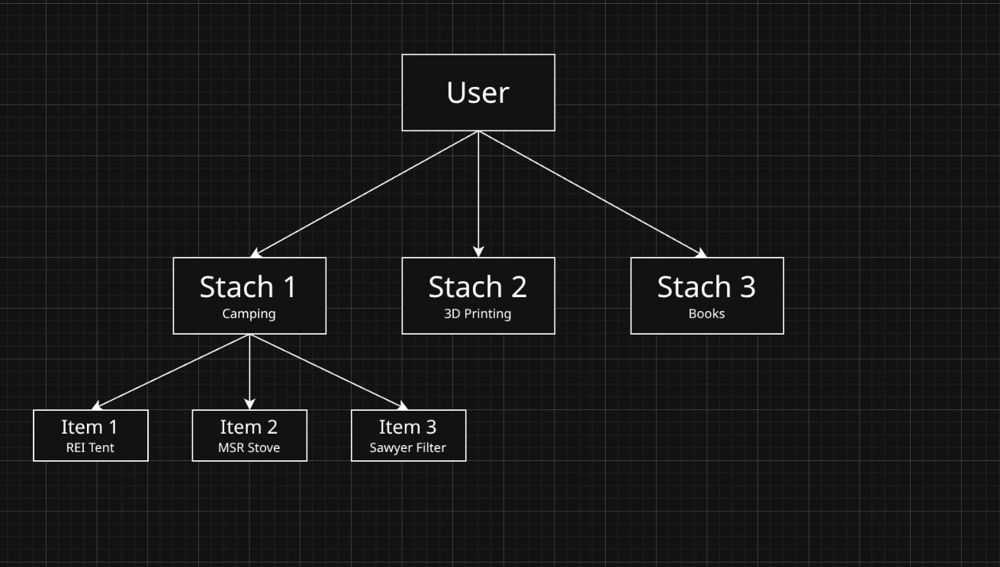

# Stache

Stache is a **offline**, *self-hosted* personal inventory system. Stache is used to keep track of your belongings, track their location,document your important product information, and receive maintenance reminders. Stache aims to help individuals that have object permanence issues to stay organized and reminded of their possessions in a productive manner. 

# What is a Stache?

A Stache is a personal container that stores items of your choice. Want a Stache to keep track of your camping gear? a Stache to keep track of your 3D printing components? a Stache to keep track of what food that you have on hand? that is all possible!

# One User Many Stache's

Stache allows users to create numerous private inventories tied to their accounts. 

# Get Reminded About Maintenance 

With Stach you can select items that you want to receive time based reminders for. Depending on user preferences, reminds can be in the form of in-app notifications, emails, SMS or app push notifications.

- Format: [Stache] [Item Title] [Item ID] [Custom Message]
- Ex: [Camping]-Black Diamond Headlamp [2] [!Replace Batteries]

# Stay On Top Of Warrenties

Tired of keeping track of when or if your manufacturer warrenty is expired on an item? Stache has you coverd.
- With Stache you can tie warrenty information to your items so that you always know when you are covered

# Stache To-Do

Stay on top of tasks and track your progress on projects.

  - **Project**: Declutter Hard Drives
    - [ ] Loose Drives
      - [ ] Crucial 1 TB NVME
      - [X] Seagate 4 TB Hard Rice
      - [ ] Raspberry Pi NVME
    - [X] Gaming PC
      - [X] Boot Drive
      - [X] WD 4 TB Steam Library Drive

